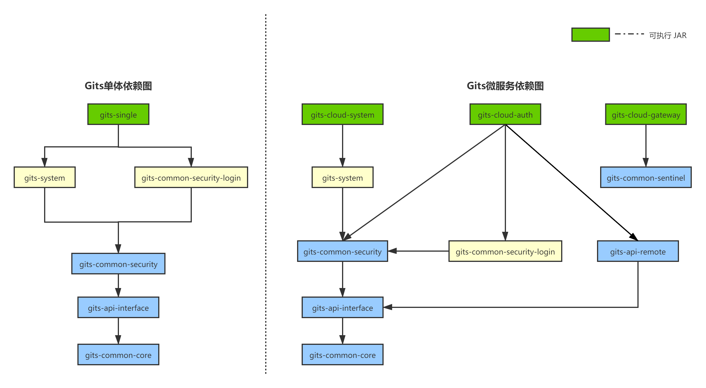

# Gits 单体与微服务快速开发平台

## 项目依赖关系

## 项目介绍

- 通过Maven打包的方式，兼容单体和微服务项目；
- 深度融合SpringSecurity，通过`@EnableGitsResourceServer`注解，灵活控制服务是否被保护（后续考虑使用OAuth2）；
- 核心业务包通过springboot自动装配的特性，结合@ConditionalOnMissingBean（存在指定bean就不装配），使得客户化开发和后续升级变的简单高效。

## 项目规划

### 业务功能模块 TODO

项目初期，很多功能还未完善。

可以关注我的微信公众号

或者添加我的个人微信：`wxh8960`

1. 前端工程：Vue
2. ~~登录：认证与授权~~
3. ~~用户模块~~
4. ~~机构管理~~
5. ~~角色权限~~
6. 数据字典
7. 参数管理
8. 数据权限